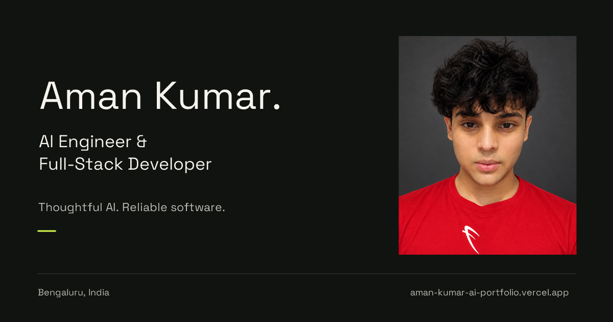

# Aman Kumar — AI / Full-Stack Engineering Portfolio

> A cinematic, inspectable portfolio for an engineer who builds accountable AI systems—not disposable demos.

[](https://aman-kumar-ai-portfolio.vercel.app)
[](https://github.com/ReaperXD67/aman-kumar-ai-portfolio/actions/workflows/verify.yml)
[](https://react.dev/)
[](https://threejs.org/)

[Live experience](https://aman-kumar-ai-portfolio.vercel.app) · [One-page résumé](https://aman-kumar-ai-portfolio.vercel.app/profile/aman-kumar-resume.pdf) · [LinkedIn](https://www.linkedin.com/in/aman-kumar-494601329/) · [GitHub profile](https://github.com/ReaperXD67)


## The idea

Most portfolios list claims. This one lets visitors inspect the system behind them.

The experience moves through a procedural **Decision Loom**, cinematic project depth, real interface previews, and a **Validation Chamber**. The identity instrument reveals the person behind the engineering: Aman's portrait assembles from pixels, with the **Systems Kernel** available as its second view.



## Authored interactions

| Surface | What it communicates |
| --- | --- |
| **Decision Loom** | A scroll-controlled sensor → reasoning → execution sequence built with React Three Fiber. |
| **Cognitive descent** | Project systems move through cinematic depth without repeating the evidence surfaces below. |
| **Engineering X-ray** | Peel a real interface into four architecture layers. Inspect 24 implementation-linked decisions, failure boundaries and trade-offs across six builds—with keyboard, touch and reduced-motion controls. |
| **Validation Chamber** | Evidence, control, infrastructure, and interface constraints reshape one live signal field. |
| **Systems Kernel** | A voxel/pixel boot sequence compiles neural, agent, and infrastructure topology into one role-specific artifact. |
| **Person / System** | A finite raster scan assembles Aman's approved portrait, then holds a clear photograph. Replay or switch to the interactive kernel with keyboard and touch controls. |
| **Living résumé** | One stable runtime manifest keeps the canonical one-page résumé replaceable without rewriting interface code. Selectable text, embedded fonts, and source links remain independently verifiable. |
| **Signal Operating System** | Persistent GitHub, LinkedIn, X, and résumé access plus `/` command search, a recruiter quick-read, native sharing, and a mobile action tray. |

## Selected systems inside the portfolio

- **KarixMC / MinePulse** — live VPS-hosted Minecraft network with a Paper-plugin boundary and an inspectable production surface.
- **AtlasLM** — evidence-grounded document intelligence with dense + sparse retrieval, reranking, and citations.
- **Autonomous Personal Agent** — controlled agent architecture with tool boundaries, memory, and safe execution paths.
- **Revive** — explainable payment-recovery orchestration with deterministic policies and verified test evidence.
- **GPT Prototype** — a twelve-layer decoder-only transformer implemented from first principles as a learning and systems artifact.

## Engineering surface

- **Interface:** React 19, Vite, TypeScript/JavaScript, responsive semantic UI
- **Spatial system:** Three.js, React Three Fiber, Drei, postprocessing
- **Motion:** GSAP, Motion, scroll-linked timelines, reduced-motion fallbacks
- **Performance:** viewport-aware rendering, hidden-tab suspension, finite portrait animation, approximately 75 KB main portrait, and a 3.2 KB first-screen thumbnail
- **Typography:** Space Grotesk + JetBrains Mono
- **Delivery:** Vercel production deployment, Sites-compatible worker output, automated build verification

## Run locally

```bash
npm install
npm run dev
```

Production verification:

```bash
npm run build
npm run test:sites
npm run test:profile
```

The build must emit `dist/client/index.html`, `dist/server/index.js`, and `dist/.openai/hosting.json`.

## Release integrity

Production changes pass the Vite build and Sites worker contract before deployment. The public résumé uses one stable route and a versioned runtime manifest; releases verify that the deployed PDF is byte-identical to the canonical local artifact, so portfolio, GitHub, and recruiter links cannot silently drift apart.

The September 2026 refresh keeps the supplied portrait on the portfolio and GitHub, with a minimal 1200 × 630 social card. Following Aman's latest preference, the canonical résumé is photo-free: one column, readable black text, embedded fonts, and specific source-grounded keywords. No hidden ranking instructions or automatic-shortlisting claims. See [asset and verification notes](docs/profile-refresh-2026-09-24.md).

The shared résumé resolver validates the runtime manifest, refreshes local document URLs when the PDF digest changes, and exposes a retryable fallback when a version check fails. The command palette supports accent-insensitive search (`resume`), `CV` aliases, ranked direct matches, and keyboard selection. Recruiter actions precede the project detail cards; mobile professional links use full labels.

PDF structural checks also run in CI. To verify a replacement locally, install `scripts/requirements-resume-qa.txt` in a Python environment and run `python scripts/verify-resume.py`. The PDF is checked for image-free structure, text order, embedded fonts, legible text, links, and ordinary metadata; this is not an ATS vendor certification.

## Project structure

```text
src/                     portfolio application and procedural scenes
public/                  project captures, résumé, certificate, runtime manifest
worker/                  Sites-compatible production worker
scripts/                 build preparation
tests/                   production handoff verification
docs/portfolio-preview.png
```

## Status

Actively maintained. The deployed experience is the canonical version; this repository is its inspectable source and verification trail.
