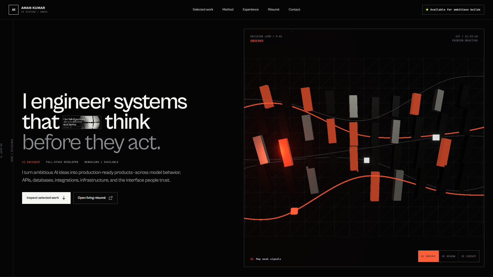

# Aman Kumar — AI / Full-Stack Engineering Portfolio

> A cinematic, inspectable portfolio for an engineer who builds accountable AI systems—not disposable demos.

[](https://aman-kumar-ai-portfolio.vercel.app)
[](https://github.com/ReaperXD67/aman-kumar-ai-portfolio/actions/workflows/verify.yml)
[](https://react.dev/)
[](https://threejs.org/)

[Live experience](https://aman-kumar-ai-portfolio.vercel.app) · [Résumé PDF](https://aman-kumar-ai-portfolio.vercel.app/profile/aman-kumar-resume.pdf) · [LinkedIn](https://www.linkedin.com/in/aman-kumar-494601329/) · [GitHub profile](https://github.com/ReaperXD67)



## The idea

Most portfolios list claims. This one lets visitors inspect the system behind them.

The experience is organized as a controlled descent through the work: a procedural **Decision Loom** turns signal into action, project transmissions expose real interfaces and architecture, a **Validation Chamber** reorganizes live system constraints, and the **Systems Kernel** reconstructs Aman's engineering identity through an interactive WebGL boot sequence.

## Authored interactions

| Surface | What it communicates |
| --- | --- |
| **Decision Loom** | A scroll-controlled sensor → reasoning → execution sequence built with React Three Fiber. |
| **Cognitive descent** | Project systems move through cinematic depth without repeating the evidence surfaces below. |
| **Project transmissions** | Live product previews, system anatomy, failure modes, verified proof, source, and deployment state. |
| **Validation Chamber** | Evidence, control, infrastructure, and interface constraints reshape one live signal field. |
| **Systems Kernel** | A voxel/pixel boot sequence compiles neural, agent, and infrastructure topology into one role-specific artifact. |
| **Living résumé** | A canonical runtime route allows the PDF source to change without rewriting interface code. |

## Selected systems inside the portfolio

- **KarixMC / MinePulse** — live VPS-hosted Minecraft network with a Paper-plugin boundary and an inspectable production surface.
- **AtlasLM** — evidence-grounded document intelligence with dense + sparse retrieval, reranking, and citations.
- **Autonomous Personal Agent** — controlled agent architecture with tool boundaries, memory, and safe execution paths.
- **Revive** — explainable payment-recovery orchestration with deterministic policies and verified test evidence.
- **GPT Prototype** — a 125M-parameter transformer implemented from first principles as a learning and systems artifact.

## Engineering surface

- **Interface:** React 19, Vite, TypeScript/JavaScript, responsive semantic UI
- **Spatial system:** Three.js, React Three Fiber, Drei, postprocessing
- **Motion:** GSAP, Motion, scroll-linked timelines, reduced-motion fallbacks
- **Typography:** Space Grotesk + JetBrains Mono
- **Delivery:** Vercel production deployment, Sites-compatible worker output, automated build verification

## Run locally

```bash
npm install
npm run dev
```

Production verification:

```bash
npm run build
npm run test:sites
```

The build must emit `dist/client/index.html`, `dist/server/index.js`, and `dist/.openai/hosting.json`.

## Project structure

```text
src/                     portfolio application and procedural scenes
public/                  project captures, résumé, certificate, runtime manifest
worker/                  Sites-compatible production worker
scripts/                 build preparation
tests/                   production handoff verification
docs/portfolio-preview.png
```

## Status

Actively maintained. The deployed experience is the canonical version; this repository is its inspectable source and verification trail.

